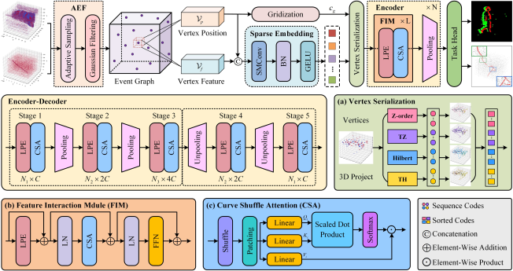

# AGFI-Net: Adaptive Graph Feature Interaction Network for Event-Based Action Recognition

The code will be released after the paper is published.

## Overview

We propose AGFI-Net, a novel framework leveraging adaptive graph construction and multi-serialization patterns. Initially, we transform event streams into event graphs by performing adaptive downsampling and denoising to preserve the sparsity of the raw data. Then, we utilize space-filling curves (SFCs) to map unordered 3D vertices into 1D sequences, enabling structured feature learning while maintaining the benefits of spatiotemporal locality. To enhance vertex encoding, we introduce serialized attention blocks with linear positional embeddings during the feature interaction phase, effectively compensating for the lack of global context.



## Installation

### Requirements

All the codes are tested in the following environment:

- Linux (Ubuntu 20.04)
- Python 3.12
- PyTorch 2.4.0
- CUDA 11.8

### Dataset Preparation

All datasets should be downloaded and placed within the `dataset` directory, adhering to the folder naming rules and structure specified for the `DvsGesture` dataset as provided in the project.

## Quick Start

Clone the repository to your local machine:

```
git clone https://github.com/hust-fstudy/AGFI-Net
cd AGFI-Net
```

Once the dataset is specified in the `dataset_dict` dictionary within the `main` function of the `run_recognition.py` file, we can train and test it using the following command:

```bash
python run_recognition.py
```

