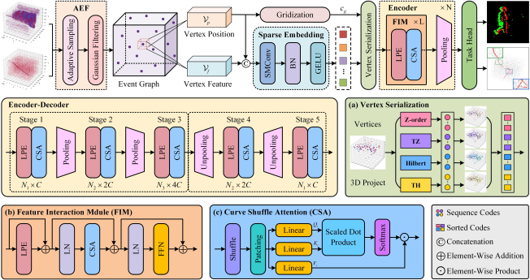

# AGFI-Net: Adaptive Graph Feature Interaction Network for Event-Based Motion Recognition and Detection

The code will be released after the paper is published.

## Overview

We propose AGFI-Net, a novel framework leveraging adaptive graph construction and multi-serialization patterns. Initially, we transform event streams into event graphs by performing adaptive downsampling and denoising to preserve the sparsity of the raw data. Then, we utilize space-filling curves (SFCs) to map unordered 3D vertices into 1D sequences, enabling structured feature learning while maintaining the benefits of spatiotemporal locality. To enhance vertex encoding, we introduce curve shuffle attention (CSA) blocks with linear positional embeddings during the feature interaction phase, effectively compensating for the lack of global context. Experimental results show that our approach surpasses the highest levels on action recognition and tiny object detection benchmarks, validating its superior performance.



## Performance

Extensive experiments demonstrate that AGFI-Net achieves SOTA performance on event-based motion recognition and detection tasks, validating the effectiveness of our proposed components.


The first and second rows show the gains of our AGFI-Net on event-based action recognition and EV-UAV detection benchmarks. Note that the bubble size indicates the number of parameters.

## Installation

### Requirements

All the codes are tested in the following environment:

- Linux (Ubuntu 20.04)
- Python 3.12
- PyTorch 2.4.0
- CUDA 11.8

### Dataset Preparation

All datasets should be downloaded and placed within the `dataset` directory, adhering to the folder naming rules and structure specified for the `DvsGesture` and `EV-UAV` datasets as provided in the project.

## Quick Start

Clone the repository to your local machine:

```
git clone https://github.com/hust-fstudy/AGFI-Net
cd AGFI-Net
```

Once the dataset is specified in the `dataset_dict` dictionary within the `main` function of the `run_rec-det.py` file, we can train and test it using the following command:

```bash
python run_rec_det.py
```

For the `EV-UAV` detection dataset, we provide pre-trained weights (`best_iou_model.pt`[default] and `best_loss_model.pt`) in the `results` directory. Use the following command to run the test:

```bash
python run_test.py
```
